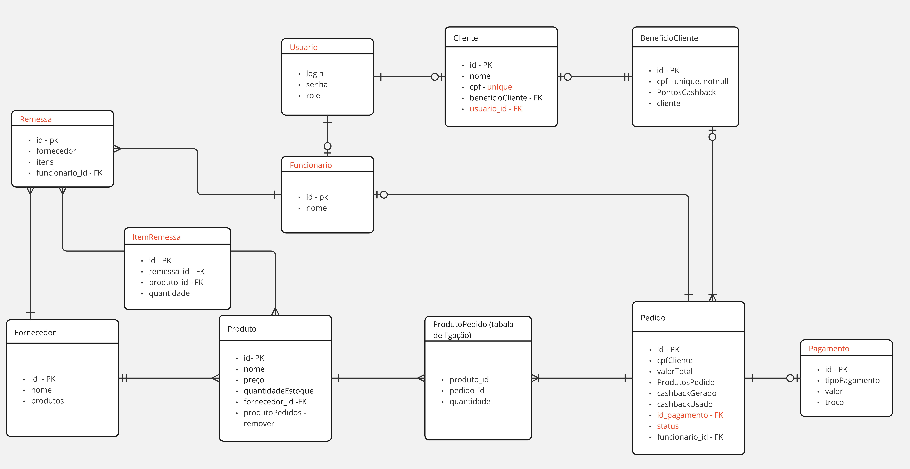

# Mercearia
### Software de mercearia utilizado pelos funcionários da loja

Diferentes produtos serão fornecidos por um fornecedor. Estamos usando um cenário onde um fornecedor fornece vários produtos únicos, onde um fornecedor não oferece o mesmo produto que outro.

O funcionário vai perguntar pelo CPF do cliente e vai registar um pedido em seu nome, onde não é necessário um cadastro prévio, apenas vinculação com CPF. O funcionário poderá fazer o cadastro do cliente incluindo o cpf aos dados do cliente em outro momento.  Ele receberá os produtos do cliente e será contabilizado no total do pedido de acordo com a quantidade (produto_pedido) e o valor de cada produto, descontando suas quantidades de estoque.

Ao um cliente finalizar um pedido, ele receberá um desconto para sua próxima compra que será armazenado em Beneficio_Cliente. Na sua próxima compra o funcionário deve informar que o cliente tem esse desconto, e caso o cliente opte por usar, será descontado do valor total da compra atual.

**Alunos: Daniel Lucena, Gabriel Vinicius, Francelmo Farias**

## Requisitos do sistema

### Transição para REST
- [x] Rotas de fornecedor
    - [x] list
    - [x] post
    - [x] get
    - [x] put
    - [x] delete
- [x] Rotas de produto
    - [x] list
    - [x] post
    - [x] get
    - [x] put
    - [x] delete
- [x] Rotas de pedido
    - [x] list
    - [x] post
- [x] Rotas de cliente
    - [x] list
    - [x] post
    - [x] get
    - [x] put
    - [x] delete
    - [x] getPedidosFromCliente

### Novas rotas
- [ ] Rotas de pedido
    - [x] get
    - [ ] put
    - [ ] delete
    - [ ] listaPorFuncionario
    - [ ] patch
- [ ] Rotas de fornecedor
    - [ ] patch
- [ ] Rotas de produto
    - [ ] patch
- [ ] Rotas de cliente
    - [ ] patch

### Entidades Novas
- [ ] Pagamento
    - [x] criar entidade: tipoPagamento(ENUM), valor, troco
    - [ ] list
    - [ ] post
    - [x] get
    - [ ] put
    - [ ] delete
- [ ] Usuario
    - [x] criar entidade: login, senha, role(cliente, caixa, repositor, gerente)
    - [ ] list
    - [x] post
    - [ ] get
    - [ ] put
    - [ ] delete
    - [x] autenticar
- [X] Funcionario
    - [X] criar entidade: nome, usuario_id
    - [X] list
    - [X] post
    - [X] get
    - [X] put
    - [X] delete
- [X] Remessa
    - [x] criar entidade: fornecedor_id, itens, funcionario_id
    - [x] list
    - [x] post
    - [x] get
    - [x] put
    - [x] delete 
- [x] ItemRemessa (entidade de ligação)
    - [x] criar entidade: remessa_id, produto_id, quantidade

### Documentação
- [x] implementar compatibilidade com swagger-ui
- [x] documentar rotas de Pedido
- [x] documentar rotas de Produto
- [x] documentar rotas de Cliente
- [x] documentar rotas de Fornecedor
- [x] documentar rotas de Remessa
- [x] documentar rotas de Funcionario
- [x] documentar rotas de Pagamento
- [x] documentar rotas de Usuario

### Segurança
- [x] implementar autenticação
- [x] implementar compatibilidade com autorização
- [x] implementar autorização para rotas de Pedido
- [x] implementar autorização para rotas de Produto
- [x] implementar autorização para rotas de Cliente
- [x] implementar autorização para rotas de Fornecedor
- [x] implementar autorização para rotas de Remessa
- [x] implementar autorização para rotas de Funcionario
- [x] implementar autorização para rotas de Pagamento
- [x] implementar autorização para rotas de Usuario.
