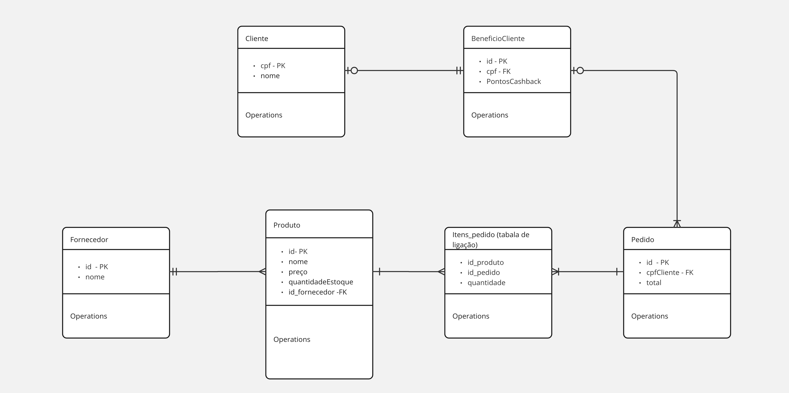

# Mercearia
### Software de mercearia utilizado pelos funcionários da loja

Diferentes produtos serão fornecidos por um fornecedor. Estamos usando um cenário onde um fornecedor fornece vários produtos únicos, onde um fornecedor não oferece o mesmo produto que outro.

O funcionário vai perguntar pelo CPF do cliente e vai registar um pedido em seu nome, onde não é necessário um cadastro prévio, apenas vinculação com CPF. O funcionário poderá fazer o cadastro do cliente incluindo o cpf aos dados do cliente em outro momento.  Ele receberá os produtos do cliente e será contabilizado no total do pedido de acordo com a quantidade (produto_pedido) e o valor de cada produto, descontando suas quantidades de estoque.

Ao um cliente finalizar um pedido, ele receberá um desconto para sua próxima compra que será armazenado em Beneficio_Cliente. Na sua próxima compra o funcionário deve informar que o cliente tem esse desconto, e caso o cliente opte por usar, será descontado do valor total da compra atual.

**Alunos: Daniel Lucena, Gabriel Vinicius, Francelmo Farias**

## Requisitos do sistema

- [x] 1\) A aplicação deve conter uma página inicial de menu contendo 4 módulos: Fornecedor, Produto, Pedido, Cliente. 
- [x] 2\) Módulo do Fornecedor (crie para essa entidade classe de modelo, repository, service, controller e páginas html que achar necessário para completar os itens a seguir) 
    - [x] a\) Deve ser criada uma entidade de Fornecedor criando a sua classe modelo com os atributos id(pk) e nome. 
    - [x] b\) Ao clicar no link do módulo do fornecedor deve ser redirecionado para uma página com a listagem dos fornecedores. (read/list)
    - [x] c\) Na página de listagem do fornecedor deve existir um link para uma página de formulário para adicionar um novo fornecedor.(create)
    - [x] d\) Ao submeter o formulário o usuário deve ser redirecionado a uma página com detalhes do fornecedor que acabou de criar.(read/get)
    - [x] e\) Na página de listagem para cada fornecedor adicione um link/botão para deletar o fornecedor. (delete)
    - [x] f\) Na página de listagem para cada fornecedor adicione um link/botão que leve a um formulário para editar o fornecedor.(edit)
    - [x] g\) Adicione o atributo produtos na entidade fornecedor, esse atributo será mapeado em OneToMany onde um fornecedor tem vários produtos.
    - [x] h\) Na página de detalhes do fonecedor, deve ser apresentado os produtos fornecidos por ele.
- [ ] 3\) Módulo do produto  (crie para essa entidade classe de modelo, repository, service, controller e páginas html que achar necessário para completar os itens a seguir) 
    - [x] a\) Deve ser criada uma entidade de Produto criando a sua classe modelo com os atributos id(pk), nome, preço, quantidadeEstoque.
    - [x] b\) Ao clicar no link do módulo do produto deve ser redirecionado para uma página com a listagem dos produtos. Para cada produto deve ser apresentado o seu nome, preço e quantidadeEstoque. (read/list)
    - [x] c\) Na página de listagem dos produtos  deve existir um link para uma página de formulário para adicionar um novo produto. Nesta página o nome dos fornecedores deve ser listado para que o usuário escolha um para o produto. O campo preço deve aceitar apenas valores numéricos. (create)
    - [x] d\) Ao submeter o formulário o usuário deve ser redirecionado a uma página com detalhes do produto que acabou de criar. (read/get)
    - [ ] e\) Na página de listagem para cada produto adicione um link/botão para deletar o produto. (delete)
    - [ ] f\) Na página de listagem para cada produto adicione um link/botão que leve a um formulário para editar o produto.(edit)
    - [ ] g\) Na página de listagem para cada produto adicione um link/botão que leve a um formulário para incrementar quantidadeEstoque em um valor fornecido pelo usuário.(edit)
    - [x] h\) Adicione o atributo fornecedor, que será mapeado em OneToMany onde um fornecedor tem vários produtos.
    - [ ] i\) Adicione o atributo pedidos, que será mapeado em ManyToMany pela tabela de ligação produto_pedido e deve conter nessa tabela a coluna quantidade que indica a quantidade de itens daquele produto presentes no pedido.
    - [x] j\) Altere a listagem, para cada produto deve ser apresentado o fornecedor dele.
    obs.: ideia de como implementar a quantidade no relacionamento entre produto e pedidos: https://www.baeldung.com/jpa-many-to-many#many-to-many-using-a-composite-key
- [ ] 4\) Módulo de Pedido (crie para essa entidade classe de modelo, repository, service, controller e páginas html que achar necessário para completar os itens a seguir) 
    - [x] a\) Deve ser criada uma entidade de Pedido criando a sua classe modelo com os atributos id(pk), cpfCliente, valorTotal.
    - [x] b\) Ao clicar no link do módulo do pedido deve ser redirecionado para uma página com a listagem dos pedidos. Para cada pedido deve ser apresentado o cpfCliente, valorTotal. (read/list)
    - [ ] c\) Na página de listagem dos pedidos deve existir um link para uma página de formulário para adicionar um novo pedido. (create)
        - [x] i\) Nesta página  deve ser mostrado uma lista com  os produtos que foram cadastrados no sistema e um campo de input do tipo number para cada item para informar a quantidade de cada produto.
        - [ ] ii\) A lista de produtos para esse formulário deve estar em ordem alfabética do nome dos produtos. (queries de busca personalizada)
        - [ ] iii\) Para cada Produto deve-se verificar se existe o valor solicitado no estoque. Caso algum item não tenha a quantidade suficiente o pedido não deve ser criado, caso exista o valor suficiente deve ser decrementado o valor do estoque de cada produto.
        - [x] iv\) Deve conter um campo de cpf do cliente que pode ficar em branco.
        - [ ] v\) Deve existir um checkbox “usar cashback nesta compra”, caso seja marcado o campo cpf for preenchido com um cpf cadastrado no sistema deve ser abatido do valorTotal o valor de cashback que o cliente possui.
        - [ ] vi\) Caso seja registrado um cpf no pedido deve ser criado uma nova entidade BeneficioCliente com cpf caso não exista. é incrementado ao atributo pontosCahsback  desse BeneficioCliente o valor de 3% de valorTotal do pedido.
    - [ ] d\) Ao submeter o formulário o usuário deve ser redirecionado a uma página com detalhes do pedido que acabou de criar. Deve ser listado os produtos que contêm pelo menos um item no pedido. Deve ser informado também quanto de cashback foi usado no pedido, o valorTotal e quanto de cashback foi gerado. (read/get)
    - [x] e\) Adicione o atributo produtos que será mapeado em ManyToMany pela tabela de ligação produto_pedido e deve conter nessa tabela a coluna quantidade que indica a quantidade de itens daquele produto presentes no pedido.
    - [ ] f\) Altere a listagem, para cada pedido deve ser listado seus produtos e suas quantidade de cada produto no pedido.
obs.: Não haverá edição nem remoção do pedido visto que os pontos de cashback já teriam sido criados e os produtos já levaram baixa no estoque.
- [ ] 5\) Módulo do cliente/beneficioCliente  (crie para essa entidade classe de modelo, repository, service, controller e páginas html que achar necessário para completar os itens a seguir) 
    - [ ] a\) Deve ser criada uma entidade de Cliente criando a sua classe modelo com os atributos id(pk), nome e cpf que será mapeado em OneToOne onde um cliente tem um beneficioCliente.
    - [ ] b\) Deve ser criada uma entidade de BeneficioCliente criando a sua classe modelo com os atributos cpf(pk), pontosCashback.
    - [ ] c\) Ao clicar no link do módulo do cliente deve ser redirecionado para uma página com a listagem dos clientes. Para cada cliente deve ser apresentado o nome, cpf e o valor de pontosCashback. (read/list)
    - [ ] d\) Na página de listagem do cliente deve existir um link para uma página de formulário para adicionar um novo cliente. Neste formulário o cliente deve informar o nome e o cpf, caso já exista um cliente com esse cpf não deve ser possível criar outro. (create)
    - [ ] e\) Ao submeter o formulário o usuário deve ser redirecionado a uma página com detalhes do cliente que acabou de criar.(read/get)
    - [ ] f\) Na página de listagem para cada cliente adicione um link/botão para deletar o cliente. (delete)
    - [ ] g\) Na página de listagem para cada cliente adicione um link/botão que leve a um formulário para editar o cliente.(edit)
